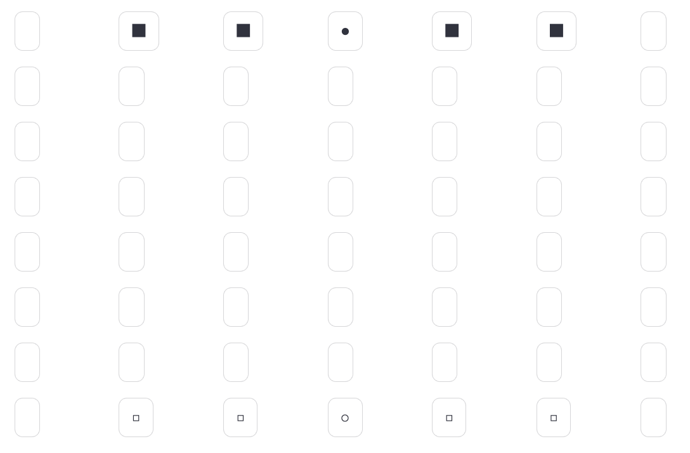

# The End of the Track - Online (Work In Progress)

This is an online version of "The End of the Track", a strategic game created by GAYA GAME - THE ART OF THINKING. This online version of the game has been created as an effort by myself, to learn how to develop games. I am not related to GAYA GAME - THE ART OF THINKING in any way, other than really liking their games.

You can buy "The End of the Track" board game online by visiting the [Gaya Game](https://www.gaya-game.com/collections/strategy-game/products/the-end-of-the-track) website.

<div style="text-align:center;">
  
</div>

## About the Game

"The End of the Track" is a strategic board game that offers exciting gameplay for players of 8+ age. This online version is a work in progress.

Enjoy the game and have fun strategizing your way to victory!

<div style="text-align:center;">
  
</div>


### Rules of the Game

- Each Player plays with 5 wooden cube and a ball.

- The cubes move Knights in the game of Chess; and the ball can move like a queen in the game of chess.

- The object of the game is to be the first player to have reached the opposite end of the board with a wooden cube and the ball.

## Setup

### Setting up a virtual environment 

1.  First, clone the repository:

    ```
    git clone https://github.com/ezermoysis1/TheEndoftheTrack.git
    ```

2.  Change your directory to where you cloned the files:

    ```
    cd TheEndoftheTrack
    ```

3.  Create a virtual environment with Python 3.11.1:

    ```
    virtualenv venv --python=python3.11.1 (or just use a previous version without indicating the python version)
    ```

4.  Activate the virtual environment. You will need to activate the venv environment in each terminal in which you want to use TheEndoftheTrack.

    ```
    source venv/bin/activate
    ```
5.  Install the required dependencies:

    ```
    pip install -r requirements.txt
    ```

## Run the app using Streamlit

    streamlit run app.py
