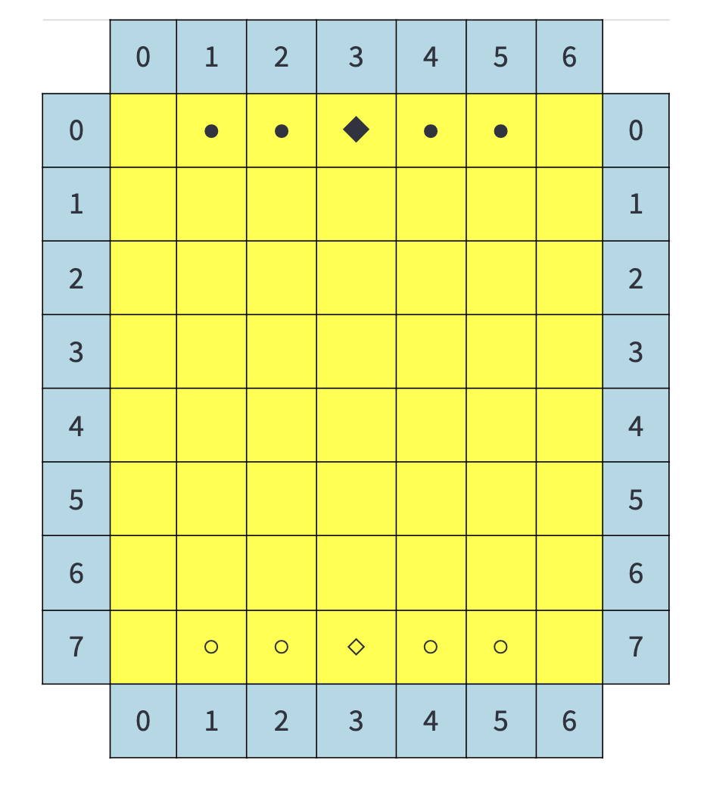

# The End of the Track (Work In Progress)




Game rules:


## Setup

### Setting up a virtual environment 

1.  First, clone the repository:

    ```
    git clone https://github.com/ezermoysis1/TheEndoftheTrack.git
    ```

2.  Change your directory to where you cloned the files:

    ```
    cd TheEndoftheTrack
    ```

3.  Create a virtual environment with Python 3.11.1:

    ```
    virtualenv venv --python=python3.11.1 (or just use a previous version without indicating the python version)
    ```

4.  Activate the virtual environment. You will need to activate the venv environment in each terminal in which you want to use TheEndoftheTrack.

    ```
    source venv/bin/activate
    ```
5.  Install the required dependencies:

    ```
    pip install -r requirements.txt
    ```

## Run the app using Streamlit

    streamlit run knightball_app.py
